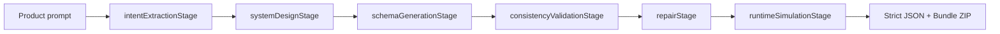

# AppCompilerAI

Live demo: https://appcompilerai.onrender.com

AppCompilerAI is a production-style **AI App Compiler** demo. It converts a natural-language product prompt into a strict executable app configuration, validates cross-layer consistency, repairs local failures, simulates runtime execution, and evaluates the compiler on real and edge-case prompts.

This is not a generic chatbot wrapper. The project demonstrates deterministic systems thinking: stage contracts, validation gates, targeted repair, runtime proof, and measurable reliability.

## Problem Statement

AI-generated software often fails because generated UI, API, database, auth, payments, and business logic do not agree with each other. AppCompilerAI treats app generation like a compiler problem:

```text
Natural language -> intent -> architecture -> schema -> validation -> repair -> runtime proof -> evaluation
```

## Architecture



Each stage emits:

- stage name
- input summary
- output summary
- status
- latency
- issues
- repair actions
- confidence score

## Strict JSON Contract

Every compile produces valid deterministic JSON with these public sections:

```json
{
  "app": {},
  "intent": {},
  "entities": [],
  "roles": [],
  "database": {},
  "api": {},
  "ui": {},
  "auth": {},
  "businessLogic": {},
  "payments": {},
  "assumptions": [],
  "clarifications": [],
  "runtimePlan": {},
  "metadata": {}
}
```

The project also keeps internal `schemaVersion`, `compiler`, `validation`, and `execution` sections for traceability and runtime proof.

## Validation And Repair Strategy

The validator detects:

- missing top-level contract keys
- duplicate entities/endpoints/routes
- invalid entity references
- UI components pointing to missing APIs
- API payload fields not present in database tables
- invalid role endpoint permissions
- missing admin permissions
- premium gating without payment plans
- dashboard widgets without data sources
- missing business-rule dependencies
- conflicting prompt requirements

Repairs are targeted. The repair engine adds or edits only the failing section, then records:

- issue code
- location
- severity
- action taken
- before value
- after value

## Runtime Simulation

Runtime proof checks:

- routes can be generated
- database tables can be created
- SQLite executes generated SQL
- API endpoints map to entities
- auth and role-based access resolve
- dashboard widgets can fetch data
- payment checkout and premium gating can be evaluated
- manifest and runtime bundle are internally consistent

The bundle ZIP contains:

- `manifest.json`
- `schema.sql`
- `preview.html`
- generated bundle `README.md`

## Evaluation Framework

The dataset contains 20 prompts:

- 10 realistic product prompts
- 10 edge cases covering ambiguity, conflicts, missing data, premium/payment contradictions, and overloaded requirements

Metrics tracked:

- success rate
- validation pass rate
- runtime pass rate
- bundle ready rate
- deterministic score
- average latency
- average repair count
- failure types
- repair types
- latency by stage

Latest verified run:

- Tests: `10 passed`
- Evaluation prompts: `20`
- Success rate: `100%`
- Validation pass rate: `100%`
- Runtime executable rate: `100%`
- Bundle ready rate: `100%`
- Deterministic score: `100%`
- Average latency: about `5.8 ms`

## Cost Vs Quality Modes

AppCompilerAI supports three deterministic local modes:

- **Fast Mode**: basic validation, lowest latency, good for quick preview
- **Balanced Mode**: field-level validation, targeted repair, SQLite and bundle proof
- **Strict Mode**: deeper dashboard, payment, auth, and runtime consistency checks

All modes are free/local and use zero model API calls in this demo. The architecture is ready for future LLM adapters while keeping validation and runtime gates outside the model.

## Tech Stack

- Python standard library HTTP server
- Python dataclasses and explicit validators
- SQLite in-memory SQL execution proof
- HTML, CSS, JavaScript frontend
- No paid API key
- No required third-party dependencies

## Run Locally

```bash
cd /Users/rohitagarwal/Desktop/AppCompilerAI
python3 server.py
```

Open:

```text
http://127.0.0.1:8765
```

## Get A Public Company URL

The easiest free deployment path is Render:

1. Create a GitHub repository and upload this `AppCompilerAI` folder.
2. Go to Render and create a new **Web Service** from that GitHub repo.
3. Use:
   - Runtime: `Python`
   - Build command: leave blank
   - Start command: `python3 server.py`
4. Add environment variable:
   - `HOST=0.0.0.0`
5. Render automatically provides `PORT`; the server reads it.
6. After deploy, Render gives a public URL like:

```text
https://appcompilerai.onrender.com
```

This repo also includes `render.yaml`, so Render can detect the deployment settings automatically.

## Test

```bash
python3 -m unittest discover -s tests
```

## Evaluate

```bash
python3 -m app.evaluation
```

The evaluation report is written to:

```text
/Users/rohitagarwal/Desktop/AppCompilerAI/appcompilerai-evaluation.json
```

## API Endpoints

- `GET /api/health`
- `GET /api/modes`
- `GET /api/evaluate?mode=balanced`
- `POST /api/compile`
- `POST /api/runtime-proof`
- `POST /api/bundle`

## Screenshots Section

Recommended screenshots for submission:

1. Main compiler dashboard with CRM prompt compiled.
2. JSON Contract tab showing strict schema.
3. Repair Log tab after clicking Repair Demo.
4. Runtime tab showing smoke tests and access matrix.
5. Evaluation tab showing 20-prompt metrics.
6. Cost/Quality tab showing Fast, Balanced, and Strict tradeoffs.

## Loom Video Script

1. Start with the problem: AI app generation fails when UI, API, DB, auth, and payments disagree.
2. Show the pipeline tabs and explain this is a compiler-style system, not a chatbot.
3. Compile the CRM SaaS sample.
4. Show the stage timeline and confidence/status per stage.
5. Open the JSON Contract tab and point out the strict top-level schema.
6. Click Repair Demo and show targeted repair logs with before/after values.
7. Open Runtime and explain SQL execution, routes, handlers, dashboard widgets, auth matrix, and smoke tests.
8. Run Evaluation and show success rate, deterministic score, failure types, repair types, and latency by stage.
9. Open Cost/Quality and explain Fast vs Balanced vs Strict.
10. Download Bundle ZIP to prove the output is an executable artifact set.

## Future Improvements

- Optional LLM adapter behind the existing stage contracts.
- Real generated backend skeleton from the manifest.
- More domain-specific validators.
- Snapshot regression files for important prompts.
- Visual diffing for generated preview pages.
- Hosted demo deployment.
